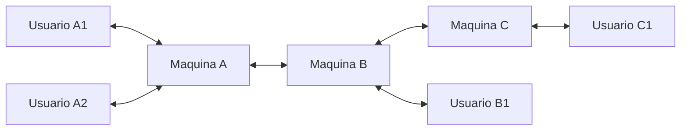

# SSC0641-file-syncer
**Trabalho de Redes de Computadores (SSC0641)**

## Introducao

O objetivo desse programa 'e proporcionar um servico de sincronizacao de arquivos por demanda entre diversar maquinas.
Entre as maquinas, as conexoes feitas seguem um modelo P2P por TCP. E dentro de uma mesma maquina, o usuario faz requesicoes
para o servico por _Unix Domain Sockets_, como se fosse um _deamon_.

